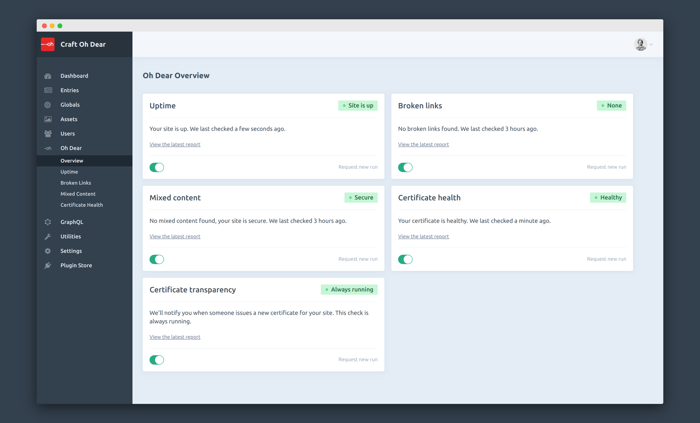

# Oh Dear plugin for Craft CMS 3.x

Integrate Oh Dear into Craft CMS.

## Requirements

This plugin requires Craft CMS 3.0.0-beta.23 or later.

## Installation

To install the plugin, follow these instructions.

1. Open your terminal and go to your Craft project:

        cd /path/to/project

2. Then tell Composer to load the plugin:

        composer require webhub-works/craft-ohdear

3. In the Control Panel, go to Settings → Plugins and click the “Install” button for Oh Dear.

## Oh Dear Overview

Craft Oh Dear provides deep integration into Craft and saves developer's time by empowering editors.

With Oh Dear you don‘t just monitor your homepage but your entire website. Oh Dear monitors uptime, checks your SSL certificates, detects broken links and mixed content. Craft Oh Dear integrates all this nicely into the Control Panel.

To learn more about the features visit the plugin store page.

## Configuring Oh Dear

Go to the settings page and paste your Oh Dear API key. (You can create a token [here](https://ohdear.app/user-settings/api).) You can choose from the sites of all teams that your personal Oh Dear account belongs to.

Currently there is no multi-site support. You can only connect to a single Oh Dear site from one Craft installation. Multi-site support is on our Roadmap. Let us know if you desperately need it.

## Oh Dear Roadmap

- Add Oh Dear performance monitoring
- Manage status page updates directly from the Control Panel
- Multi-site support
- Optimizing the element edit workflow for broken links and mixed content
- Translate the plug-in to German (let us know which language you‘d like to see)

Brought to you by [webhub](https://webhub.de)
